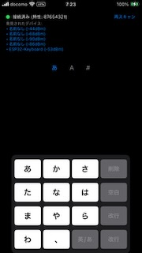
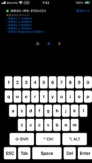
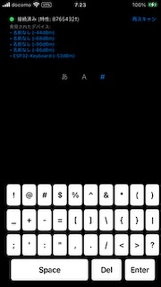
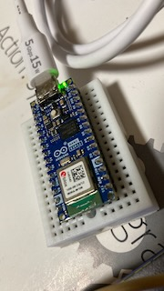

# マイコンを通じて iPhone をパソコンのキーボードにする

## 概要

以下のように Arduino Nano ESP32 を用いて iPhone をパソコンのキーボードにします。

```text
iPhone -- (BLE) --> Arduino Nano ESP32 -- (USB) --> PC
```

iPhone が BLE セントラルで Arduino Nano ESP32 が BLE ペリフェラルで接続し、iPhone が ASCII コードを Arduino Nano ESP32 に送信し Arduino Nano ESP32 はスキャンコードを HID デバイスとして PC に送信します。






以下のイメージです。

| This Proj.              | Commercial keyboard |
| ----------------------- | ------------------- |
| Arduino Nano ESP32 (BT) | Wireless dongle     |
| iPhone (App)            | Keyboard (Physics)  |

## Pros

- AppStore にある Air Keyboard 系アプリにはない利点がある
  - パソコン向けの**アプリのインストールが不要**
  - **かなフリックに対応**してるので現代日本人にとってシームレスに利用できる
- iOS 側のアプリはキーボードとして振る舞う (ESC/Tab/Ctrl など利用可能)
- Arduino Nano ESP32 をパソコンに USB 接続するだけで動くので手間がかからない
- Bluetooth 5 を利用してるので Wi-Fi にもその他無線機器にも干渉しずらい
- iOS アプリは縦で利用可能なので片手で文字入力が完結する

## Cons

- Arduino Nano ESP32 かそれに準ずるマイコンを用意する必要がある

## 用意するもの

- [Arduino Nano ESP32](https://docs.arduino.cc/hardware/nano-esp32/)
- [Arduino IDE 2](https://docs.arduino.cc/software/ide-v2/tutorials/getting-started-ide-v2/)
- iPhone
- Apple Silicone Mac
- Xcode

## Arduino IDE 2

### ボードマネージャの選択

- **Arduino ESP32 Boards** by Arduino

### ライブラリの選択

- 何も入れない

注意:

- esp32 by Espressif Systems は表記が Arduino ESP32 で紛らわしいので注意。
- 技術的検証など行う場合は esp32 by Espressif Systems をインストールする。
  - Arduino ESP32 Boards by Arduino は削除する。
- USBHID は上記のボードマネージャと競合するから不要。
  - esp32 by Espressif Systems を入れた場合は USBHID ライブラリを入れておく。
- Arduino Nano ESP32 は DFU モードにする。
  - Arduino Nano ESP32 の boot ボタンを押しっぱで電源に接続
  - Mac の場合、/dev/tty.cuXXXXXXXXXXXX になる。

## セットアップ

1. Arduino Nano ESP32 を Mac に接続
2. iPhone を Mac に接続
3. ESP32/esp32-s3/esp32-s3.ino を Arduino IDE 2 で開く
4. 「→」をクリックしビルド＆デプロイ
5. BLEUSBKBD/BLEUSBKBD.xcodeproj を Xcode で開く
6. 「▶︎」をクリックしビルド＆デプロイ

## ToDo

- Windows 端末で動作確認したい……
