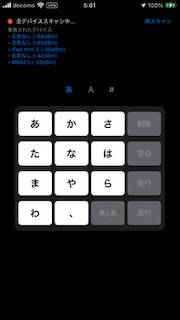
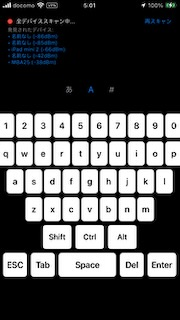
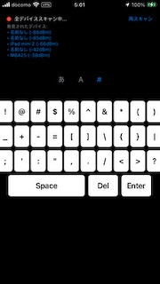

# マイコンを通じて iPhone をパソコンのキーボードにする

## 概要

Arduino Nano ESP32 を用いて iPhone をパソコンの HID デバイス (キーボード) にする。

```text
iPhone -- (BLE) --> Arduino Nano ESP32 -- (USB) --> PC
```

iPhone が BLE セントラルで Arduino Nano ESP32 がペリフェラルで、接続後は iPhone が ASCII コードを Arduino Nano ESP32 に送信し Arduino Nano ESP32 はスキャンコードを HID デバイスとして PC に送信する。





## 準備

- [Arduino Nano ESP32](https://docs.arduino.cc/hardware/nano-esp32/)
- [Arduino IDE 2](https://docs.arduino.cc/software/ide-v2/tutorials/getting-started-ide-v2/)
- iPhone
- Apple Silicone Mac
- Xcode

## Setup Arduino IDE 2

### ボードマネージャの選択

- **Arduino ESP32 Boards** by Arduino

### ライブラリの選択

- 何も入れない

注意:

- esp32 by Espressif Systems は表記が Arduino ESP32 で紛らわしいので注意。
- 技術的検証など行う場合は esp32 by Espressif Systems をインストールする。
  - Arduino ESP32 Boards by Arduino は削除する。
- USBHID は上記のボードマネージャと競合するから不要。
  - esp32 by Espressif Systems を入れた場合は USBHID ライブラリを入れておく。
- Arduino Nano ESP32 は DFU モードにする。
  - Arduino Nano ESP32 の boot ボタンを押しっぱで電源に接続
  - Mac の場合、/dev/tty.cuXXXXXXXXXXXX になる。
